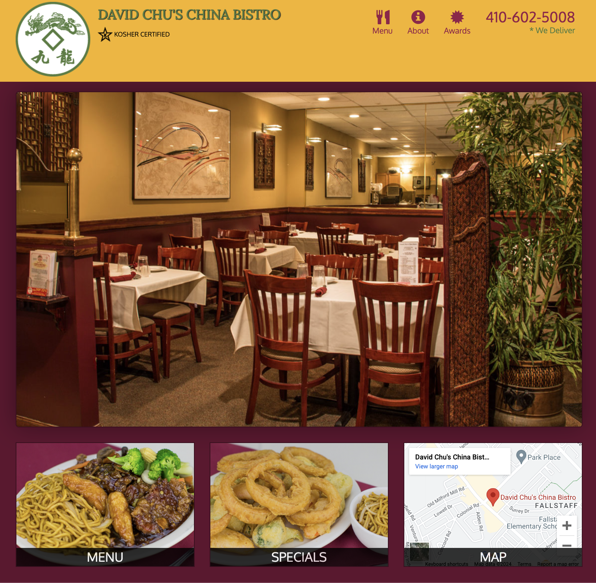

# RestaurantCoursera
------------------

This repository contains the codebase for a restaurant website developed as part of a Coursera project.

### Table of Contents

*   [About](#about)
*   [License](#license)

### About

The project within this repository consists of a restaurant website named "David Chu's China Bistro". It includes HTML, CSS, and JavaScript files to create a dynamic and interactive web interface for the restaurant. Key features of the website include:

*   **Navigation**: The website features a responsive navigation bar that collapses into a toggle button for smaller screens.
*   **Menu Display**: Users can view the restaurant's menu categories and items dynamically loaded using JavaScript.
*   **Information Pages**: The website includes sections for About and Awards, although these sections are currently static placeholders.
*   **Contact Information**: Contact details including the restaurant's phone number and address are provided.
*   **Footer**: The footer contains information about the restaurant's hours of operation, address, delivery details, and testimonials.

Feel free to explore the files to understand the structure and implementation of the website.

### License

This project is licensed under the terms of the MIT license. See the [LICENSE](LICENSE) file for details.

* * *

For more information, please refer to the original repository: [RestaurantCoursera](https://github.dev/gargmegham/RestaurantCoursera).